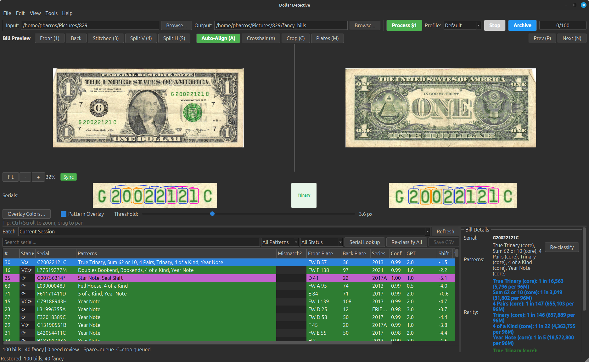
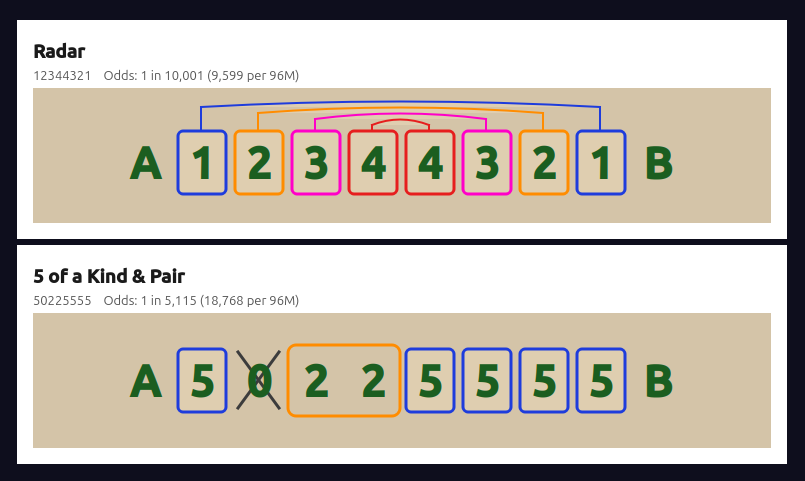
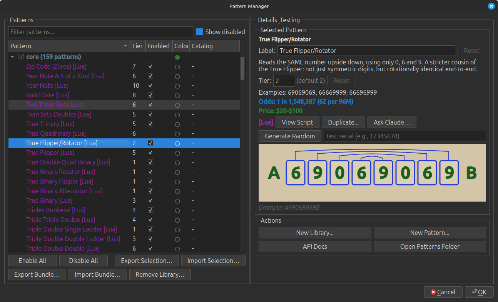
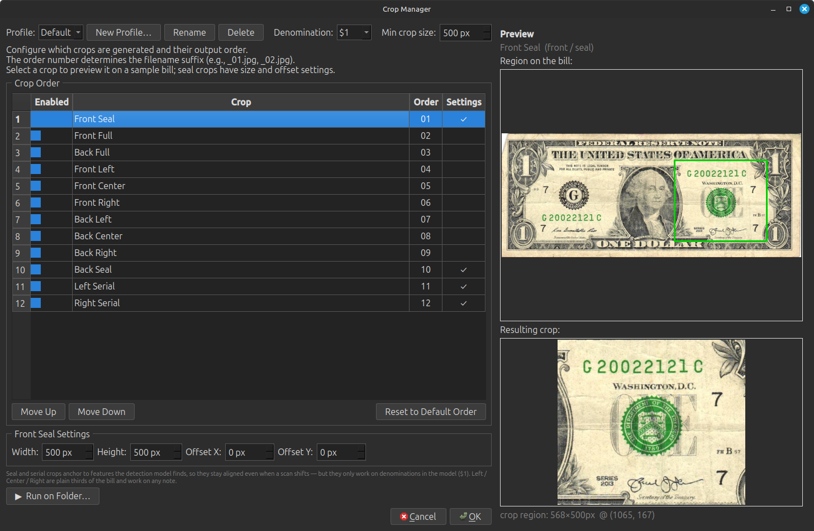

# Dollar Detective

**A desktop app for spotting "fancy" serial numbers on US paper currency.** Feed it
scanned dollar bills, and it finds the serial numbers, reads them, and flags the
collectible ones — radars, repeaters, ladders, low serials, birthdays, ZIP codes,
and a few hundred more patterns — so you don't have to eyeball every note.


-8A2BE2)

> ### 🤖 Open source, and written by AI — up front about both
> Dollar Detective is **open source**, and essentially all of its code was written
> by an AI assistant (Anthropic's Claude) working from a hobbyist's ideas and
> testing. There's no team behind it — just one person, his family testers, and a
> lot of back-and-forth with an AI. It's shared as-is, for fun and for other
> collectors. See [License](#license) and [Disclaimer](#disclaimer).

---

## Contents

- [What it does](#what-it-does)
- [Screenshots](#screenshots)
- [Download & install](#download--install)
  - [Windows](#windows)
  - [macOS](#macos-apple-silicon)
  - [Linux](#linux)
- [Updating](#updating)
- [Fancy serial patterns](#fancy-serial-patterns)
- [The standalone Crop Tool](#the-standalone-crop-tool)
- [Performance](#performance)
- [Running from source (developers)](#running-from-source-developers)
- [How it works](#how-it-works)
- [Roadmap](#roadmap)
- [Disclaimer](#disclaimer)
- [Acknowledgements](#acknowledgements)
- [License](#license)

---

## What it does

Point it at a folder of scanned bills and it will:

- **Find and read serial numbers** — locates the serial regions with an object-
  detection model, then reads them with OCR, correcting common currency-font
  confusions (I↔T, O↔0↔Q, G↔6, etc.).
- **Classify fancy serials** — checks each serial against a large built-in library
  (100+ core patterns plus the full *Green Guide* collection): solids, radars,
  repeaters, ladders, binaries, low serials, star notes, birthdays/dates, ZIP
  codes, and many more.
- **Show its work** — draws overlays on each bill highlighting the digits and the
  relationships that make a serial fancy (arcs, group boxes, colored highlights).
- **Handle multiple denominations** — $1 and $2 (one district letter) plus $5 and
  up (two leading letters), selectable per crop profile.
- **Detect print quirks collectors care about** — "gas pump" digit misalignment,
  treasury-seal shift/overprint offset, and plate/series info (with basic mule
  detection).
- **Organize & crop** — auto-classify front/back, fix upside-down scans, correct
  skew, and (optionally) produce ready-to-share crops of just the keepers.
- **Extend without code** — build your own patterns with a point-and-click wizard,
  write them in Lua, or describe them in plain English and let a built-in AI
  generator write the pattern for you (you bring your own API key).

It runs **entirely on your computer** — your scans never leave your machine.

---

## Screenshots

> _Screenshots coming soon._ Drop images into `docs/screenshots/` and uncomment the
> lines below.

<!--  -->
<!--  -->
<!--  -->
<!--  -->

| Main window | Pattern overlay | Pattern Manager |
|:-----------:|:---------------:|:---------------:|
| _placeholder_ | _placeholder_ | _placeholder_ |

---

## Download & install

Grab the latest installer for your OS from the
**[Releases page](https://github.com/ptbarros/dollar-bill-processor/releases/latest)**.

Dollar Detective is **not code-signed** (signing certificates are expensive for a
free hobby project), so Windows and macOS will show a one-time "unknown developer"
warning. The steps below explain how to get past it. This is normal for small
open-source apps — but as always, only run installers you downloaded from the
official Releases page above.

### Windows

Three editions are published — they differ only in how they accelerate detection:

| Installer | Use when |
|-----------|----------|
| `DollarDetective-<version>-setup.exe` | **Default.** Best for most PCs (Intel graphics acceleration, safe CPU fallback everywhere). |
| `DollarDetective-<version>-directml-setup.exe` | You have an AMD or NVIDIA GPU and no Intel graphics. |
| `DollarDetective-<version>-cuda-setup.exe` | You have an NVIDIA GPU and want maximum speed. Larger download. |

**Install:** download the `.exe` and run it. It's a per-user install — **no admin
rights needed**.

**Getting past the SmartScreen warning:** Windows may show
_"Windows protected your PC."_ Click **More info → Run anyway**. (This appears
because the app isn't signed, not because anything is wrong with it.)

### macOS (Apple Silicon)

Download `DollarDetective-arm64.dmg`, open it, and drag **Dollar Detective** to your
Applications folder.

**Getting past Gatekeeper (required on first launch):** because the app is
unsigned, double-clicking may appear to do nothing. Do one of the following **once**:

- **Right-click** the app → **Open** → confirm **Open** in the dialog, **or**
- Run this in Terminal (adjust the path if you didn't move it to Applications):
  ```bash
  xattr -dr com.apple.quarantine "/Applications/Dollar Detective.app"
  ```

After that first launch it opens normally. _(Intel Macs aren't currently built —
this is an Apple-Silicon build.)_

### Linux

Download `DollarDetective-x86_64.AppImage`, make it executable, and run it:

```bash
chmod +x DollarDetective-x86_64.AppImage
./DollarDetective-x86_64.AppImage
```

If you get a **FUSE** error, run it in extract-and-run mode instead:

```bash
./DollarDetective-x86_64.AppImage --appimage-extract-and-run
```

---

## Updating

Dollar Detective checks GitHub for a newer release on startup (you can also trigger
it from **Help → Check for Updates**). When one is available it shows what's new.

- **Windows:** it can download and launch the matching installer for you.
- **macOS / Linux:** it opens the Releases page so you can grab the new build.

You can turn the startup check off in **Settings → Interface**.

---

## Fancy serial patterns

A "fancy" serial number is one collectors find desirable because of a pattern in its
digits. Dollar Detective ships with a large library and lets you add your own:

- **Built-in library** — the common families (solid, radar, repeater, ladder,
  binary, low serial, star note, and more) plus the full **[Green Guide](#acknowledgements)**
  collection of named patterns.
- **Pattern Wizard** — build patterns by picking a recipe (ladder, pairs,
  palindrome, binary, …) with no coding.
- **Lua scripting** — for full control, patterns are small [Lua](https://www.lua.org/)
  scripts with a simple, sandboxed API and rich visualization (highlights,
  connectors, group boxes).
- **AI generation** — describe a pattern in plain English and let the built-in
  generator write the Lua for you. Requires your own Anthropic or OpenAI API key
  (configured in **Settings → AI**); nothing is sent anywhere without your key.
- **Enable/disable & share** — turn individual patterns or whole libraries on and
  off in the **Pattern Manager**. Share your *setup* (which patterns are on/off) via
  Export/Import Selection, or share the *patterns themselves* — including any data
  file they use — as a single `.ddpat` bundle via Export/Import Bundle.

---

## The standalone Crop Tool

There's also a **separate, lightweight Crop Tool** — just the cropping feature,
without the full app — for quickly cropping a folder of scans using your saved crop
settings. It's published on its own under the
[Releases page](https://github.com/ptbarros/dollar-bill-processor/releases) with
`croptool-` tags, for Windows, macOS, and Linux. Same install/Gatekeeper notes as
above apply.

---

## Performance

Speed depends heavily on your hardware and which edition you install. These are
**real measurements on a 100-bill batch** from machines we've tested — treat them as
a rough guide, not a guarantee:

| Machine | Edition | ~100 bills | Rate |
|---------|---------|-----------:|-----:|
| NVIDIA RTX 5060 + Intel i5-14400F | **CUDA** (NVIDIA) | ~33 sec | ~180 bills/min |
| Laptop with Intel Iris Xe graphics (i7-1185G7) | **Default** (Intel-graphics accelerated) | ~65 sec | ~108 bills/min |
| The same RTX 5060 box, on the non-CUDA build | **DirectML** (Lite) | ~2.8 min | ~37 bills/min |
| Older desktop, Intel UHD 630 graphics (i5-9500T) | **Default** (falls back to CPU) | ~3 min | ~32 bills/min |

Takeaways:

- An **NVIDIA GPU with the CUDA edition is by far the fastest** (~180 bills/min).
- On a **modern Intel laptop/desktop** (Iris / Iris Xe / Arc graphics), the default
  edition uses the built-in Intel graphics and is very quick (~100 bills/min) — no
  discrete GPU needed.
- **Older Intel graphics, AMD, or F-series (no integrated graphics)** chips fall back
  to the CPU and land around **30–50 bills/min** — still perfectly usable for a
  stack of a few hundred bills, just slower.
- The GPU acceleration toggle is in **Settings → Processing** if you want to compare.

---

## Running from source (developers)

You'll need **Python 3.12**. From the repo root:

```bash
# Create and activate a virtual environment
python3 -m venv venv
source venv/bin/activate            # Windows: venv\Scripts\activate

# Install dependencies (torch-free stack: ONNX Runtime + RapidOCR)
pip install -r requirements.txt

# Launch the GUI
python run_gui.py
```

For the CUDA/torch build (NVIDIA), use `requirements-cuda.txt` instead. The Windows,
macOS, and Linux installers are built by GitHub Actions from the `*.spec` files when
a version tag is pushed — see `.github/workflows/`.

---

## How it works

- **Detection:** a small YOLO-family object-detection model (run via
  [ONNX Runtime](https://onnxruntime.ai/)) locates the serial-number regions on each
  aligned bill. The default builds are **torch-free** for a small footprint; an
  optional CUDA edition uses PyTorch for NVIDIA GPUs.
- **OCR:** [RapidOCR](https://github.com/RapidAI/RapidOCR) (default) or EasyOCR
  (CUDA edition) reads the characters, with currency-font confusion correction and
  seal-based verification of the district letter.
- **Classification:** each serial is run through the Lua pattern engine, which
  evaluates the enabled patterns and returns matches plus visualization data.
- **UI:** built with [PySide6](https://doc.qt.io/qtforpython/) (Qt for Python).

---

## Roadmap

Currently free, actively tinkered on when time allows. Ideas on the table (no
promises or timelines):

- More denominations and better handling of busy $5+ backgrounds
- Refinements to the crop/organize workflow
- A possible "review from the couch" companion for phones/tablets

---

## Disclaimer

Dollar Detective is a **hobby project for currency collectors**. It is **not
affiliated with, endorsed by, or connected to** the U.S. Department of the Treasury,
the Bureau of Engraving and Printing, or any government agency. Pattern
classifications and value/rarity hints are **for entertainment and collecting
interest only** — they are not appraisals. Always verify anything important
yourself. The software is provided **as-is, with no warranty**.

---

## Acknowledgements

- **The Green Guide** — many of the named patterns are based on definitions from the
  well-known collectors' guide to fancy serial numbers. Pattern *names and
  descriptions* originate with that work and are credited to its author(s).
- **Training data** — the detection model was trained with help from the Roboflow
  project ["dollar-bill-serial-number"](https://universe.roboflow.com/turt1e/dollar-bill-serial-number)
  (CC BY 4.0).
- **Built with** [PySide6](https://doc.qt.io/qtforpython/),
  [ONNX Runtime](https://onnxruntime.ai/),
  [RapidOCR](https://github.com/RapidAI/RapidOCR),
  [lupa/Lua](https://github.com/scoder/lupa), and
  [Anthropic's Claude](https://www.anthropic.com/) (which wrote the code).

---

## License

Copyright (C) 2026 Paul Barros.

Dollar Detective is free and open source software, licensed under the
**[GNU Affero General Public License v3.0](LICENSE)** (AGPL-3.0).

In plain terms: you're free to use, study, share, and modify it — but **anything you
build from this code must also be released as open source under this same license,
including if you run a modified version as a network service.** You can't take this
code, make a few changes, and ship it as a closed-source or paid product. See the
[LICENSE](LICENSE) file for the full terms.

> **Note on pattern content:** the code is AGPL-3.0, but many of the *pattern
> definitions* (names and descriptions) originate with **The Green Guide** (see
> [Acknowledgements](#acknowledgements)) and may carry their own copyright
> independent of the software license.
